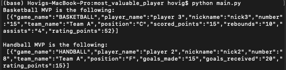

# The Most Valuable Player (MVP)

Read the PDF file called `MVP requirements.pdf` for the proposed problem.

#### To run the code from a terminal:
* `unzip` the folder
* `cd` to it
* run `python main.py`

#### The output will look like the following:

